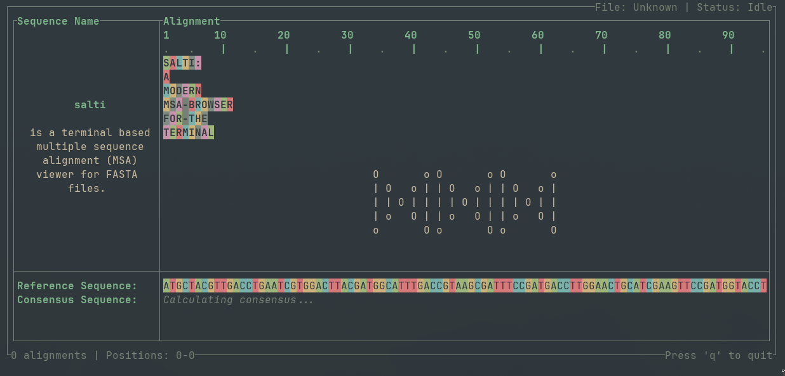

[](https://github.com/Sam-Sims/salti/actions/workflows/test.yaml)
[](https://github.com/Sam-Sims/salti/actions/workflows/check.yaml)

# salti


`salti` is a terminal based multiple sequence alignment (MSA) viewer for FASTA files.
It is designed for fast interactive browsing primarily on remote servers, and HPC environments, or anytime you dont want to leave the terminal.
<br>
<p align="center">
  
</p>

## Features

https://github.com/user-attachments/assets/2592a9ac-43ba-42bc-8a29-e4d1d42d904a

### Fast

`salti` is built for speed while browsing and loading large alignments.

### Command palette

Press `:` to open a command palette for most actions. See [Usage](#command-palette-1) for details.

### Nucleotide and Amino acid support

`salti` automatically detects whether your alignment is nucleotide (NT) or amino acid (AA), then applies the correct rendering mode.

### Translation

Can translate NT codons to AA on the fly, with support for all 3 frames, although designed for browsing, rather than a dedicated translation tool.

### Diff views

Two comparison focused display modes are available:

- `toggle-reference-diff` to highlight differences against a selected reference sequence.
- `toggle-consensus-diff` to highlight differences against the consensus sequence.

## Installation

### Binaries:

Precompiled binaries for Linux, MacOS and Windows are attached to the latest
release.

### Cargo:

Requires [cargo](https://www.rust-lang.org/tools/install)

```bash
cargo install salti
```

### Build from source:

#### Install rust toolchain:

To install please refer to the rust documentation: [docs](https://www.rust-lang.org/tools/install)

#### Clone the repository:

```bash
git clone https://github.com/Sam-Sims/salti
```

#### Build and add to path:

```bash
cd salti
cargo build --release
export PATH=$PATH:$(pwd)/target/release
```

All executables will be in the directory `salti/target/release`.


## Usage

Tested on my setup (Arch linux + ghostty) - but should work on any modern terminal.

```bash
salti <alignment.fasta>
```

If no file is passed, the app starts and waits for you to load one via the command palette.

## Quick start keybinds

I plan to add a help screen in the future for reference in app, but for now here are the most useful keybindings:

### Global keybindings

- `q` - Quit.
- `:` - Opens the command palette.
- `Up` / `Down` - Scroll vertically
- `Left` / `Right` - Scroll horizontally.
- `Shift` + A navigation key scrolls faster in that direction.
- `Alt+Left` / `Alt+Right` - Scroll sequence name pane.

### Command palette

Most features can be accessed through the command palette (this is heavily inspired by the helix editors implementation!).

Open with `:`, then type a command.

- `Enter` confirms selection.
- `Tab` / `Shift+Tab` cycles any candidates.
- `Esc` closes the palette.

Commands:

- `jump-position` - Jump to a 1-based alignment position.
- `jump-sequence` - Jump to a sequence by name
- `pin-sequence` - Pin a visible sequence to the top of the alignment view.
- `unpin-sequence` - Remove a sequence from the pinned group.
- `set-filter` - Filter visible sequences by regex.
- `clear-filter` - Clear the active filter.
- `set-reference` - Set a reference sequence .
- `toggle-translate` - Toggle AA translation.
- `toggle-reference-diff` - Renders reference mismatches as `.`
- `toggle-consensus-diff` - Renders consensus mismatches as `.`
- `load-alignment` (alias: `load`) - Load an alignment file.
- `set-consensus-method` - Choose `majority` or `majority-non-gap`.
- `set-translation-frame` - Set translation frame (`1`, `2`, or `3`).
- `set-theme` - Set active theme (currently only 1 `everforest-dark`).
- `set-sequence-type` - Override auto-detection if it fails (`dna` or `aa`).
  - `quit` - Quit the app.

## Some notes on features

### Fuzzy matching
All commands that take string input support fuzzy matching. For example, `jump-sequence` will match any sequence name that contains the input string.
If multiple candidates match, you can cycle through them with `Tab` / `Shift+Tab`.

### Consensus method
Two methods are available for consensus calculation:
- `majority` - The most common character at each position, including gaps.
- `majority-non-gap` - The most common character at each position, excluding gaps

If there is a tie for most common character, one is chosen at random.

Consensus is calculated in the background

### Pinned behaviour
- Pinned sequences stay visible and remain at the top, even when they do not match the active filter.
- Setting a sequence as reference removes it from pinned state and hides it as the reference row.

### Data/Rendering

- Input must be FASTA with equal sequence lengths across records.
- Sequence type is auto-detected on load; you can override it if its wrong.
    - It tries to work this out by picking 100 random alignments and checking if over 50% of characters are valid amino acid characters. If so, it assumes its an AA alignment, otherwise NT.
