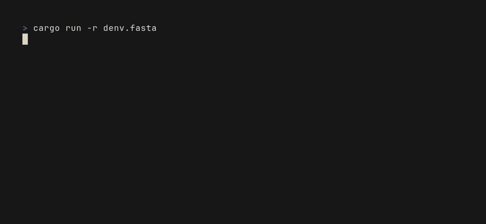
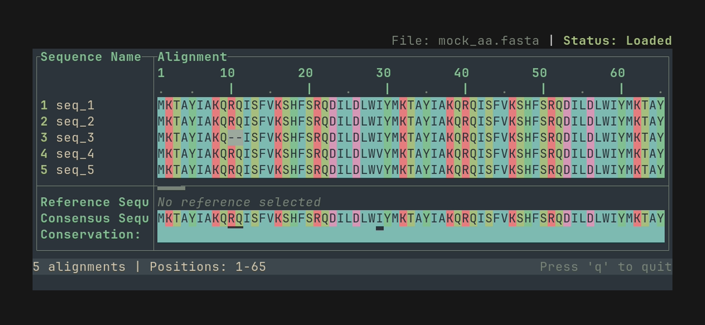
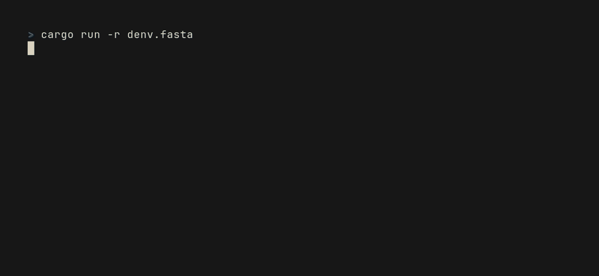
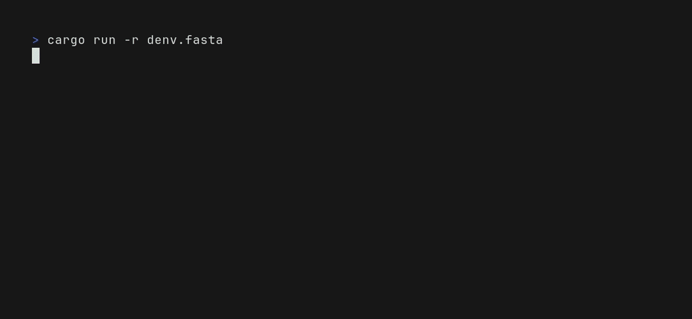

[](https://github.com/Sam-Sims/salti/actions/workflows/test.yaml)
[](https://github.com/Sam-Sims/salti/actions/workflows/check.yaml)

# salti

`salti` is a terminal based multiple sequence alignment (MSA) viewer for FASTA files.
It is designed for fast interactive browsing primarily on remote servers, and HPC environments, or anytime you dont want
to leave the terminal.
<br>
<p align="center">
  
</p>

## Contents

- [Features](#features)
- [Installation](#installation)
- [Usage](#usage)
- [Some notes on features](#some-notes-on-features)

## Features

### Fast

`salti` is built for fast browsing and loading of large alignments, using [tokio](https://github.com/tokio-rs/tokio) for
async processing. This is in part achieved by:

- Background threads handle tasks such as consensus/conservation calculation and file loading, allowing these to
  complete dynamically without blocking the UI.
- Rendering only the visible portion of the alignment, updating the view on state changes rather than every frame tick,
  and caching consensus and conservation calculations in a window around the currently visible region.

It can handle alignments with thousands of sequences and >200,000 positions without lag (tested with ~3k mpox
alignments)

### Transparent support for HTTP/SSH/Compressed files

Thanks to the cool [Paraseq](https://github.com/noamteyssier/paraseq) library `salti` can transparently load compressed
fasta files, as well as files over
HTTP/HTTPS or SSH. Just provide the URL or SSH path to the `load` command, e.g.
`:load https://example.com/alignment.fasta` or `:load ssh://user@host/path/to/alignment.fasta`.

### Command palette

Press `:` to open a command palette for most actions. See [Usage](#command-palette-1) for details.


### Mouse support

`Left click` to select a sequence/position, `Ctrl+left click` to select a region.

Hold middle mouse to pan around the alignment.



### Minimap

Press `m` to open the minimap and drag to quickly pan around.


### Nucleotide and Amino acid support

`salti` automatically detects whether your alignment is nucleotide (NT) or amino acid (AA), then applies the correct
rendering mode.



### Translation

Can translate NT codons to AA on the fly, with support for all 3 frames, although designed for browsing, rather than a
dedicated translation tool.


### Useful viz tools

- Collapse positions that match the reference or consensus to `.` for easier visualisation of differences.
- Mouse selection to highlight regions or sequences
- Pin important sequences fixed at the top while browsing.



### Themes

`salti` supports multiple colour themes, which can be switched with the `set-theme` command. Available themes so far
are:

- `everforest-dark` - the default theme, based on the everforest colorscheme.
- `solarized-light` - a light theme based on the solarized palette.
- `tokyo-night` - a dark theme based on the tokyo night palette.
- `terminal-default` - uses terminal-provided ANSI colours and defaults.



## Installation

### Conda:


```
conda install -c bioconda salti
```

### Binaries:

Precompiled binaries for Linux, MacOS and Windows are attached to the latest
release.

### Cargo:

Requires [cargo](https://www.rust-lang.org/tools/install)

```bash
cargo install salti
```

### Build from source:

#### Install rust toolchain:

To install please refer to the rust documentation: [docs](https://www.rust-lang.org/tools/install)

#### Clone the repository:

```bash
git clone https://github.com/Sam-Sims/salti
```

#### Build and add to path:

```bash
cd salti
cargo build --release
export PATH=$PATH:$(pwd)/target/release
```

All executables will be in the directory `salti/target/release`.

## Usage

I would recommend a modern terminal, with GPU acceleration and 24-bit colour (true colour) support for the best
experience.
Additionally, a font with Unicode support is required to render all characters correctly.

I would also recommend a large terminal window for the best experience, but the app is designed to be usable
even in smaller windows.

`salti` is primarily developed and benchmarked in [Ghostty](https://ghostty.org/). I have tested it on several other
terminals and it works well in most cases, though performance may vary. If you have responsiveness issues, please open
an issue and include your terminal emulator and font information.

```bash
salti <alignment.fasta>
```

If no file is passed, the app starts and waits for you to load one via the command palette.

## Quick start keybinds

I plan to add a help screen in the future for reference in app, but for now here are the most useful keybindings:

### Global keybindings

- `q` - Quit.
- `:` - Opens the command palette.
- `Up` / `Down` - Scroll vertically 1 row
- `Left` / `Right` - Scroll horizontally 1 column.
- `Shift` + `Left`/`Right`/`Up`/`Down` scrolls 10 columns/rows in that direction.
- `Alt+Left` / `Alt+Right` - Scroll sequence name pane.
- `Left cick` - Select a sequence or position. Click again to clear selection.
- `Ctrl + Left click` - Select a range of sequences or positions
- `Middle click + drag` - Pan.
- `m` - Open the minimap

### Command palette

Most features can be accessed through the command palette (this is heavily inspired by the helix editors
implementation!).

Open with `:`, then type a command.

- `Enter` confirms selection.
- `Tab` / `Shift+Tab` cycles any candidates.
- `Esc` closes the palette.

Commands:

- `jump-position` - Jump to a 1-based alignment position.
- `jump-sequence` - Jump to a sequence by name
- `pin-sequence` - Pin a visible sequence to the top of the alignment view.
- `unpin-sequence` - Remove a sequence from the pinned group.
- `set-filter` - Filter visible sequences by regex.
- `clear-filter` - Clear the active filter.
- `set-reference` - Set a reference sequence .
- `toggle-translate` - Toggle AA translation.
- `set-diff-mode` - Set diff rendering mode (`off`, `reference`, or `consensus`).
- `load-alignment` (alias: `load`) - Load an alignment file.
- `set-consensus-method` - Choose `majority` or `majority-non-gap`.
- `set-translation-frame` - Set translation frame (`1`, `2`, or `3`).
- `set-theme` - Set active theme (`everforest-dark`, `solarized-light`, `tokyo-night`, or `terminal-default`).
- `set-sequence-type` - Override auto-detection if it fails (`dna`, `aa`, or `full`).
- `check-update` - Check for updates and show the latest version.
- `quit` - Quit the app.

## Some notes on features

### Fuzzy matching

All commands that take string input support fuzzy matching. For example, `jump-sequence` will match any sequence name
that contains the input string.
If multiple candidates match, you can cycle through them with `Tab` / `Shift+Tab`.

### Consensus method

Two methods are available for consensus calculation:

- `majority` - The most common character at each position, including gaps.
- `majority-non-gap` - The most common character at each position, excluding gaps

If there is a tie for most common character, one is chosen at random.

Consensus is calculated in the background

### Pinned behaviour

- Pinned sequences stay visible and remain at the top, even when they do not match the active filter.
- Setting a sequence as reference removes it from pinned state and hides it as the reference row.

### Data/Rendering

- Input must be FASTA with equal sequence lengths across records.
- Sequence type is auto-detected on load; you can override it if its wrong.
    - It samples up to 100 random alignments and compares NT and AA character fractions. If neither crosses 50%, it
      falls back to `full` mode.

### Update check:

`salti` will check for updates on startup and notify you if a new version is available. It does this by
querying the crates api: https://crates.io/api/v1/crates. However, no network connection is required, and will not cause
any issues if the check fails.

This behaviour can be disabled entirely by setting `SALTI_SKIP_UPDATE_CHECK=true`. You can still check for updates
manually with the `check-update` command.
